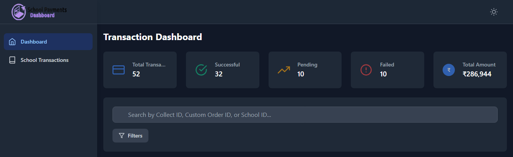
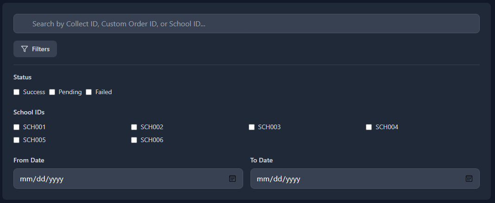
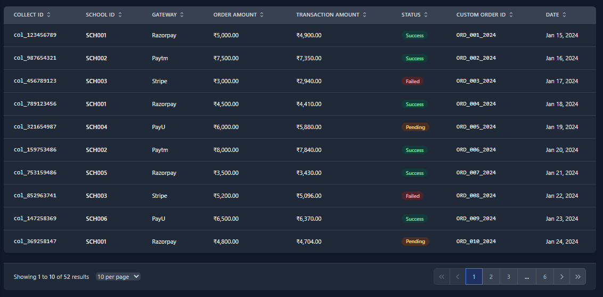
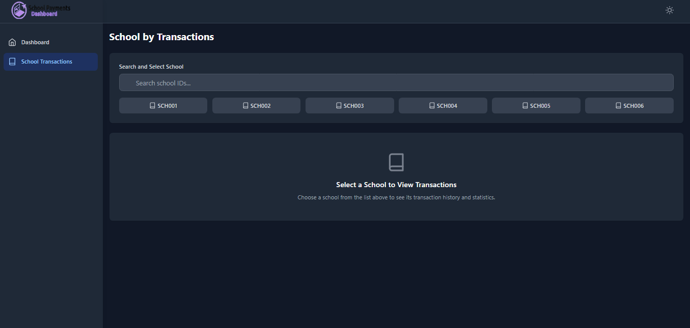
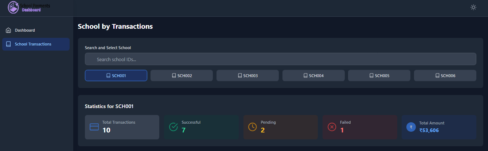
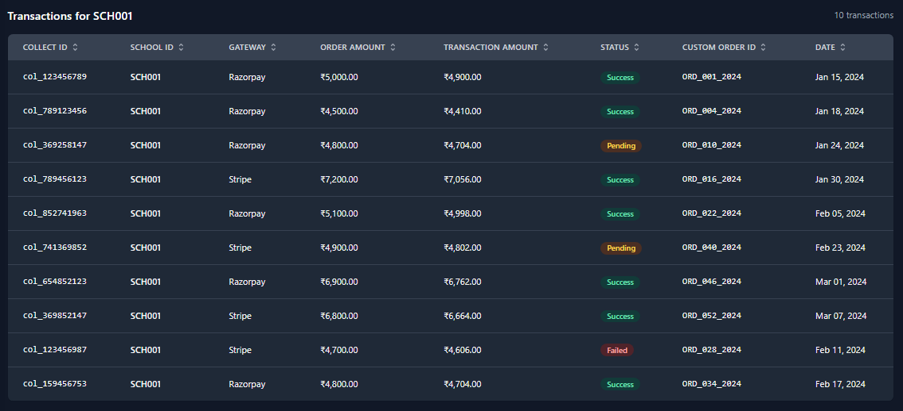

# School Payments Dashboard

A responsive **School Payments Dashboard** app for managing transactions, fetching 52 mock transactions via **Axios**, with filtering, sorting, pagination, and dark/light mode.  
Includes a table with a date column and animations.

## Features

- **Dynamic Data Fetching**: Axios with 500ms delay.
- **Dashboard**: Stats, filters, sortable table, pagination.
- **Transactions by School**: School selector, stats, table (no sorting/pagination).
- **Dark/Light Mode** and error handling.

## Screenshorts

## - Dashboard Pages







## - School Transactions






## Instructions on How to Run/Start the Project on a Local Server

1. #### clone the repo using this command
   ```bash
   git clone https://github.com/AyushChaursiaya/SPD_Application
   ```
2. #### Install yarn dependencies
   ```bash
   npm install
   ```
3. #### Start the development server:
   ```bash
   npm run dev
   ```
4. #### Open your browser and navigate to:
   ```bash
   http://localhost:5173
   ```
5. #### Deployed Link for the Assignment:
   [assignment](https://spd-application.vercel.app/)

## For any queries related to the project, contact at ayushchaurasiya289@gmail.com
